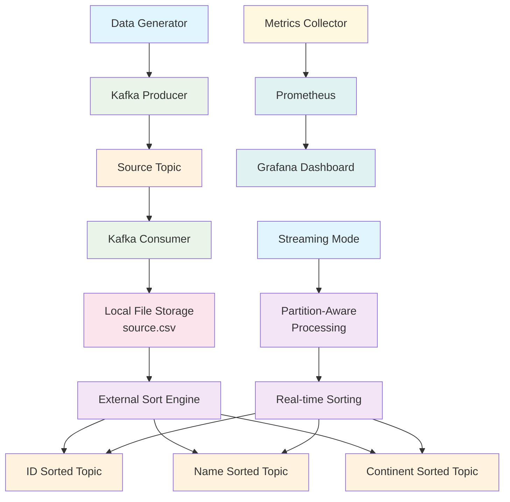

# **Kafka Sorting Pipeline (Golang)**

This project implements a **high-performance data generation and sorting pipeline** in Golang.

The pipeline:

The code is structured for **performance**, **memory efficiency**, **fault tolerance**, and **clarity**.

---

## **Pipeline Architecture Diagram**



---

## **Schema**

Each generated record contains four fields:

* **id** (`int32`): random 32-bit integer
* **name** (`string`): lowercase English letters, length **10–15**
* **address** (`string`): alphanumeric + space, length **15–20**, **no commas**
* **continent** (`string`): one of

  * North America
  * Asia
  * South America
  * Europe
  * Africa
  * Australia

Example CSV rows:

```text
21,axxxxxxxxx,12 abc dfsf LdUE,Asia
2,bxxxxxxxxy,9282 abc sf LdAUE,Africa
```

---

## **Architecture Overview**

High-level workflow:

1. **Generator + Producer (Go + kafka-go)**
   - Uses a random generator that strictly respects the schema.
   - Streams records in batches (10k messages) into Kafka topic `source`.
   - Supports configurable retry mechanisms with exponential backoff.

2. **Consumer → Flat File**
   - A dedicated consumer reads exactly N records from `source` and writes
     them to a local file `source.csv` in the container's filesystem.
   - Using a flat file decouples Kafka IO from sorting and avoids re-reading
     from Kafka multiple times.
   - Supports offset management through consumer groups for fault tolerance.

2. **Consumer → Local Flat File**

   * Reads exactly `RECORDS` messages from Kafka
   * Writes them into `/tmp/pipeline-data/source.csv`

3. **External Sort Pipeline**
   For each sort key (`id`, `name`, `continent`):

   **Chunk Phase:**

   * Read `chunkSize` records into memory
   * Sort in-memory chunk
   * Write sorted chunk to disk

   **K-Way Merge Phase:**

   * Open all sorted chunk files
   * Merge using a min-heap keyed by the sort column
   * Stream the merged result directly to a Kafka output topic

4. **Real-time Streaming Mode**
   - Alternative streaming mode processes data in real-time with partition-aware processing.
   - Supports horizontal scaling through concurrent partition processing.
   - Processes data as it arrives rather than in batch mode.

5. **Runtime Reporting**
   - The pipeline measures and prints wall-clock time for:
     - Data generation + production
     - Consumption into file
     - Sort + produce (each key)
     - Overall runtime
   - Comprehensive metrics collection for monitoring and observability.

---

## **Streaming Mode Architecture**

``mermaid
graph TD
    A[Kafka Source Topic] --> B[Partition 0 Consumer]
    A --> C[Partition 1 Consumer]
    A --> D[Partition 2 Consumer]
    A --> E[Partition 3 Consumer]
    
    B --> F[Sort Worker 0]
    C --> G[Sort Worker 1]
    D --> H[Sort Worker 2]
    E --> I[Sort Worker 3]
    
    F --> J[Sorted Output - ID Topic]
    F --> K[Sorted Output - Name Topic]
    F --> L[Sorted Output - Continent Topic]
    
    G --> J
    G --> K
    G --> L
    
    H --> J
    H --> K
    H --> L
    
    I --> J
    I --> K
    I --> L
    
    M[Metrics Collector] --> N[Prometheus Endpoint]
    
    style A fill:#fff3e0
    style B fill:#e1f5fe
    style C fill:#e1f5fe
    style D fill:#e1f5fe
    style E fill:#e1f5fe
    style F fill:#f3e5f5
    style G fill:#f3e5f5
    style H fill:#f3e5f5
    style I fill:#f3e5f5
    style J fill:#fff3e0
    style K fill:#fff3e0
    style L fill:#fff3e0
    style M fill:#fff8e1
    style N fill:#e0f2f1
```

In streaming mode:
- Each Kafka partition is consumed by a dedicated worker goroutine
- Records are sorted in memory as they arrive
- Sorted records are immediately produced to the appropriate output topics
- This enables real-time processing without waiting for complete dataset

---

## **Detailed External Sort Architecture**

``mermaid
graph LR
    A[Source CSV File] --> B[Chunk Reader]
    B --> C[Memory Buffer 1]
    B --> D[Memory Buffer 2]
    B --> E[Memory Buffer N]
    
    C --> F[In-Memory Sort]
    D --> G[In-Memory Sort]
    E --> H[In-Memory Sort]
    
    F --> I[Chunk File 1]
    G --> J[Chunk File 2]
    H --> K[Chunk File N]
    
    I --> L[K-Way Merge]
    J --> L[K-Way Merge]
    K --> L[K-Way Merge]
    
    L --> M[Min-Heap]
    M --> N[Sorted Output Stream]
    N --> O[Kafka Producer]
    
    style A fill:#e1f5fe
    style B fill:#f3e5f5
    style C fill:#fff3e0
    style D fill:#fff3e0
    style E fill:#fff3e0
    style F fill:#e8f5e8
    style G fill:#e8f5e8
    style H fill:#e8f5e8
    style I fill:#fce4ec
    style J fill:#fce4ec
    style K fill:#fce4ec
    style L fill:#f3e5f5
    style M fill:#fff8e1
    style N fill:#e0f2f1
    style O fill:#e1f5fe
```

This external sort approach allows processing of datasets larger than available memory by:
1. Breaking the data into manageable chunks that fit in memory
2. Sorting each chunk individually
3. Writing sorted chunks to disk
4. Using a k-way merge with a min-heap to produce the final sorted output

---

## Enhanced Features

### Fault Tolerance and Resilience
- **Offset Management**: Consumer groups for automatic offset tracking and recovery.
- **Retry Mechanisms**: Exponential backoff retry logic for all Kafka operations.
- **Graceful Shutdown**: Proper cleanup and resource management on interruption.

### Observability
- **Structured Logging**: Detailed logging with timestamps for debugging and monitoring.
- **Metrics Collection**: Comprehensive metrics for generation, consumption, sorting, and production.
- **Progress Tracking**: Periodic progress reports during long-running operations.

### Scalability
- **Partition-Aware Processing**: Concurrent processing of Kafka partitions for horizontal scaling.
- **Configurable Concurrency**: Adjustable concurrency levels for optimal resource utilization.
- **Memory Efficiency**: Controlled memory usage through chunked processing.

### Real-time Processing
- **Streaming Mode**: Process data in real-time as it arrives in Kafka topics.
- **Continuous Operation**: Run indefinitely, processing new data as it becomes available.
- **Partition-Level Parallelism**: Each Kafka partition processed by a dedicated goroutine.

---

## **Algorithms and Design Choices**

### **Random Data Generation**

* Efficient UTF-8-safe string builder
* No commas → simple CSV parsing
* Uniform distribution of continents
* ID is generated via `rand.Int31()`

### **Kafka IO**

- Uses the pure-Go `github.com/segmentio/kafka-go` client.
- Producer:
  - Batches of 10,000 messages to reduce overhead.
  - Snappy compression enabled.
  - Configurable acknowledgment levels.
- Consumer:
  - Supports both sequential reading and consumer group-based offset management.
  - Configurable buffer sizes for optimal throughput.

  * Batch size: 10,000
  * Snappy compression
  * RequiredAcks=0 (fastest possible)
* Consumer:

  * No offset commits
  * Deterministic sequential read

### **External Sort**

Since 50M rows cannot fit in 2GB RAM → **external merge sort**.

1. **Chunk Sort:**

   * Sort <2M rows at a time
   * Safe bounded memory usage

2. **K-way Merge:**

   * Heap holds only 1 row per chunk
   * Output streamed sequentially to Kafka

This is the same algorithm used by modern databases and distributed systems.

---

## **Project Layout**

```
kafka-sorting-pipeline/
  cmd/
    pipeline/
      main.go           # Orchestrates full pipeline
  internal/
    data/
      record.go         # Record struct, random generator, CSV encode/decode
    kafkautil/
      kafka.go          # Kafka reader/writer helper functions
    sorter/
      external_sort.go  # External sort implementation (chunk + k-way merge)
    streaming/
      processor.go      # Real-time streaming processor with partition awareness
    metrics/
      metrics.go        # Metrics collection and reporting
  scripts/
    build.sh            # Build Docker image
    run.sh              # Example usage
    start.sh            # Entry point inside pipeline container
  Dockerfile
  go.mod
  README.md
```

---

## **Building the Docker Image**

### **Prerequisites**

* Docker
* Kafka cluster (e.g., via docker-compose)
* Minimum 2GB RAM + 4 CPU cores allocated to Docker

### **Build**

```bash
cd kafka-sorting-pipeline
./scripts/build.sh
```

This creates the Docker image:

```
kafka-sorting-pipeline:latest
```

The script will print a **ready-to-use `docker run` command**.

---

## **Running the Pipeline**

Start Kafka (example: via docker-compose), then run the printed command:

```bash
docker run --rm \
  --network=<your-docker-network> \
  -e KAFKA_BROKER=kafka:9092 \
  -e RECORDS=50000000 \
  -e CHUNK_SIZE=2000000 \
  kafka-sorting-pipeline:latest
```

This will:

1. Wait for Kafka
2. Generate N records
3. Produce to topic `source`
4. Consume to `/tmp/pipeline-data/source.csv`
5. Perform all three sorts
6. Produce sorted results
7. Print detailed timing metrics

### Streaming Mode

To run in real-time streaming mode:

```bash
docker-compose run --rm pipeline -streaming=true -concurrency=4
```

In streaming mode:
- The pipeline continuously processes data from Kafka topics
- Each partition is processed by a separate goroutine
- Data is sorted and produced in real-time as it arrives
- Supports graceful shutdown with Ctrl+C

---

## **Step-by-Step Setup Instructions**

### **1. Prerequisites**

* Docker and Docker Compose installed
* Minimum 2GB RAM + 4 CPU cores allocated to Docker
* Internet connection for pulling Docker images

### **2. Kafka Cluster Setup**

The pipeline requires a Kafka cluster with specific topics and configurations. You can use the provided `docker-compose.yml` file which includes:

#### **Kafka Broker Settings**

```yaml
KAFKA_BROKER_ID: 1
KAFKA_ZOOKEEPER_CONNECT: "zookeeper:2181"
KAFKA_LISTENERS: PLAINTEXT://0.0.0.0:9092
KAFKA_ADVERTISED_LISTENERS: PLAINTEXT://kafka:9092
KAFKA_OFFSETS_TOPIC_REPLICATION_FACTOR: 1
KAFKA_AUTO_CREATE_TOPICS_ENABLE: "false"
```

#### **Required Kafka Topics**

The pipeline requires 4 topics to be created with the following specifications:

| Topic Name | Partitions | Replication Factor | Purpose |
|------------|------------|-------------------|---------|
| `source` | 4 | 1 | Stores raw generated data |
| `id` | 4 | 1 | Stores data sorted by ID |
| `name` | 4 | 1 | Stores data sorted by Name |
| `continent` | 4 | 1 | Stores data sorted by Continent |

Each topic is created with 4 partitions to enable parallel processing.

### **3. Starting the Complete Environment**

```bash
# Navigate to the project directory
cd kafka-sorting-pipeline

# Start all services (Zookeeper, Kafka, Pipeline, Prometheus, Grafana)
docker-compose up -d

# Check if all services are running
docker-compose ps
```

Expected output should show all containers in "Up" status:
* zookeeper
* kafka
* kafka-init (completes and exits)
* pipeline
* prometheus
* grafana

### **4. Manual Kafka Topic Creation (if needed)**

If you're using an external Kafka cluster, create the topics manually:

```bash
# Create source topic
kafka-topics --create --if-not-exists \
  --bootstrap-server <your-kafka-broker>:9092 \
  --partitions 4 \
  --replication-factor 1 \
  --topic source

# Create sorted topics
kafka-topics --create --if-not-exists \
  --bootstrap-server <your-kafka-broker>:9092 \
  --partitions 4 \
  --replication-factor 1 \
  --topic id

kafka-topics --create --if-not-exists \
  --bootstrap-server <your-kafka-broker>:9092 \
  --partitions 4 \
  --replication-factor 1 \
  --topic name

kafka-topics --create --if-not-exists \
  --bootstrap-server <your-kafka-broker>:9092 \
  --partitions 4 \
  --replication-factor 1 \
  --topic continent
```

### **5. Verify Topic Creation**

```bash
# List all topics
kafka-topics --bootstrap-server <your-kafka-broker>:9092 --list

# Describe topic configuration
kafka-topics --bootstrap-server <your-kafka-broker>:9092 --describe --topic source
kafka-topics --bootstrap-server <your-kafka-broker>:9092 --describe --topic id
kafka-topics --bootstrap-server <your-kafka-broker>:9092 --describe --topic name
kafka-topics --bootstrap-server <your-kafka-broker>:9092 --describe --topic continent
```

### **6. Pipeline Configuration Options**

Environment variables that can be customized:

| Variable | Default | Description |
|----------|---------|-------------|
| `KAFKA_BROKER` | `kafka:9092` | Kafka broker address |
| `RECORDS` | `1000000` | Number of records to generate |
| `CHUNK_SIZE` | `100000` | Records per in-memory chunk |
| `SOURCE_TOPIC` | `source` | Input topic name |
| `ID_TOPIC` | `id` | ID-sorted output topic |
| `NAME_TOPIC` | `name` | Name-sorted output topic |
| `CONTINENT_TOPIC` | `continent` | Continent-sorted output topic |
| `WORKDIR` | `/tmp/pipeline-data` | Working directory for temporary files |

### **7. Command-Line Arguments**

The pipeline accepts the following command-line arguments:

| Argument | Default | Description |
|----------|---------|-------------|
| `-broker` | `kafka:9092` | Kafka bootstrap broker address |
| `-source-topic` | `source` | Source topic name |
| `-id-topic` | `id` | Sorted-by-id topic name |
| `-name-topic` | `name` | Sorted-by-name topic name |
| `-continent-topic` | `continent` | Sorted-by-continent topic name |
| `-records` | `50000000` | Number of records to generate (0 for continuous streaming) |
| `-chunk-size` | `2000000` | Number of records per in-memory chunk during external sort |
| `-workdir` | `/tmp/pipeline-data` | Working directory for temporary files |
| `-skip-generate` | `false` | Skip generation step and only sort existing source topic |
| `-skip-sort` | `false` | Skip sort step (only generate) |
| `-group-id` | `sorting-pipeline-consumer` | Kafka consumer group ID for offset management |
| `-streaming` | `false` | Enable streaming mode for real-time processing |
| `-concurrency` | `4` | Concurrency level for streaming processing |
| `-metrics-port` | `:8080` | Port for Prometheus metrics endpoint |

### **8. Running the Pipeline**

#### **Batch Mode (Default)**

```bash
# Run with default settings
docker-compose run --rm pipeline

# Run with custom settings
docker-compose run --rm -e RECORDS=1000000 -e CHUNK_SIZE=50000 pipeline
```

#### **Streaming Mode**

```bash
# Run in streaming mode
docker-compose run --rm pipeline /app/pipeline -streaming=true -records=0 -concurrency=4
```

### **9. Monitoring and Metrics**

The pipeline exposes Prometheus metrics on port 8080:

* **Access metrics directly**: `http://localhost:8080/metrics`
* **Prometheus dashboard**: `http://localhost:9090`
* **Grafana dashboard**: `http://localhost:3000` (admin/admin)

Key metrics available:
* `pipeline_records_generated_total` - Total records generated
* `pipeline_records_consumed_total` - Total records consumed
* `pipeline_records_sorted_total` - Total records sorted
* `pipeline_records_produced_total` - Total records produced
* Error counters for each operation phase

---

## **Troubleshooting Common Issues**

### **Port Already Allocated**

If you encounter an error like "port is already allocated":

```bash
# Check what's using the port
lsof -i :8080

# Stop conflicting containers
docker-compose down

# Restart services
docker-compose up -d
```

### **Kafka Connection Issues**

If the pipeline fails to connect to Kafka:

1. Verify Kafka is running:
   ```bash
   docker-compose ps
   ```

2. Check Kafka logs:
   ```bash
   docker-compose logs kafka
   ```

3. Test Kafka connectivity:
   ```bash
   docker-compose exec kafka kafka-topics --bootstrap-server localhost:9092 --list
   ```

### **Insufficient Memory**

If you encounter memory issues with large datasets:

1. Reduce the chunk size:
   ```bash
   docker-compose run --rm -e CHUNK_SIZE=500000 pipeline
   ```

2. Increase Docker memory allocation in Docker settings.

### **Topic Already Exists**

If topics already exist and you want to recreate them:

```bash
# Delete existing topics
docker-compose exec kafka kafka-topics --bootstrap-server localhost:9092 --delete --topic source
docker-compose exec kafka kafka-topics --bootstrap-server localhost:9092 --delete --topic id
docker-compose exec kafka kafka-topics --bootstrap-server localhost:9092 --delete --topic name
docker-compose exec kafka kafka-topics --bootstrap-server localhost:9092 --delete --topic continent

# Restart the kafka-init service to recreate topics
docker-compose up -d --force-recreate kafka-init
```

---

# **How to Verify the Pipeline Functionality**

Follow the steps below to validate correctness and performance.

---

## **1. Build the Docker image**

### What is Optimized

- **Batching & Compression**
  - Kafka producer batches 10,000 messages at a time and uses Snappy compression.
- **Sequential IO**
  - Flat file writes/reads are buffered (1 MiB buffers) and sequential, which is efficient on disk.
- **External Merge Sort**
  - Memory bound is controlled by `CHUNK_SIZE`. You can tune it based on the available memory.
- **Heap-based Merge**
  - K-way merge uses a minimal comparison per record per chunk, which is optimal for large sorted runs.
- **Retry Logic**
  - Exponential backoff for transient failures improves reliability.
- **Partition-Level Parallelism**
  - Concurrent processing of Kafka partitions maximizes throughput.

### Where the Major Bottlenecks Are

For large data volumes (50M rows), the main bottlenecks are:

1. **Disk IO During External Sort**
   - Reading and writing large chunk files dominates CPU time.
2. **Kafka Network IO**
   - Producing and consuming 50M messages is also heavy but can be mitigated with batching and compression.
3. **Serialization Overhead**
   - CSV encoding/decoding per record is relatively cheap but still non-trivial at this scale.

---

## **2. Copy the generated Docker run command**

The build script prints something like:

```bash
docker run --rm \
  --network=<your-docker-network> \
  -e KAFKA_BROKER=kafka:9092 \
  -e RECORDS=50000000 \
  -e CHUNK_SIZE=2000000 \
  kafka-sorting-pipeline:latest
```

Copy it.

---

## **3. Execute the command (modify if needed)**

- This repository is designed to be self-contained for the Golang app and its Docker image.
- The Kafka cluster is expected to be provided by the environment (e.g., via `docker-compose` as shown above).
- You can tune:
  - `RECORDS` (number of generated records),
  - `CHUNK_SIZE` (records per in-memory chunk),
  - Kafka batch and buffer sizes (by editing `internal/kafkautil/kafka.go`).
- The streaming mode provides real-time processing capabilities for continuous data flows.
